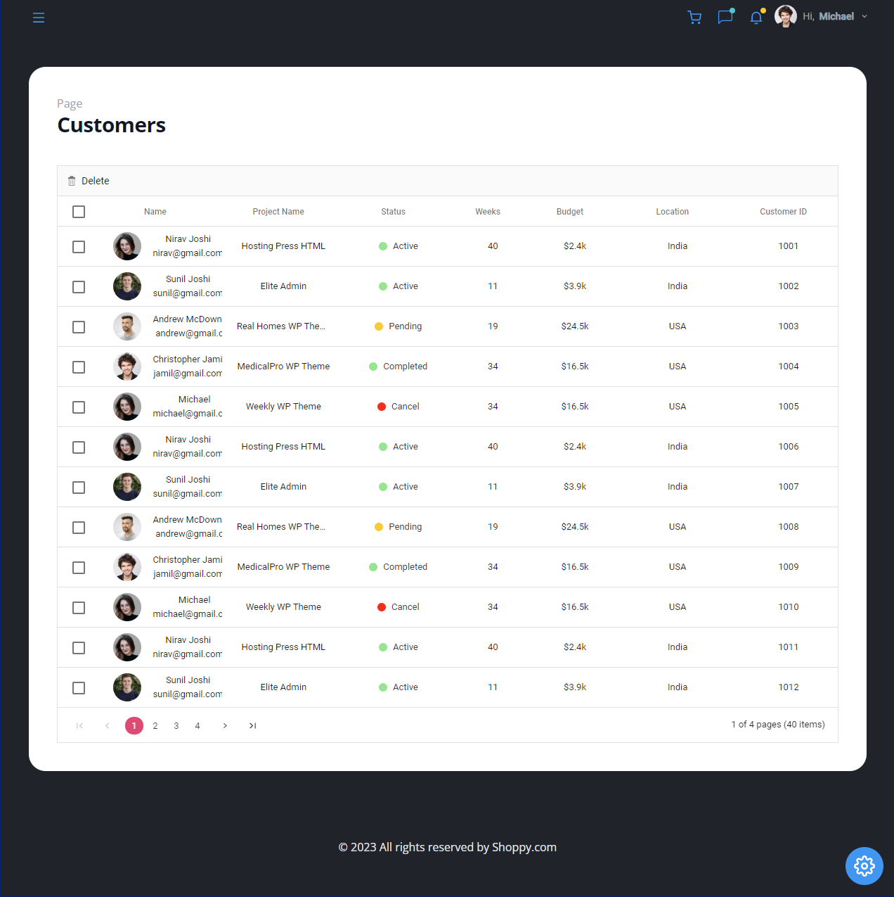

Shoppy Dashboard Application
============================

[Live Website](https://utkarsh-shoppy-dashboard.netlify.app/)

Welcome to the Shoppy Dashboard, an advanced application powered by Syncfusion's comprehensive React UI Components Library. With an expansive range of features, this dashboard delivers an exceptional user experience, catering to a variety of needs.  

The heart of the Shoppy Dashboard lies in its utilization of Syncfusion, a versatile UI Components Library for React. This integration brings forth a seamless and responsive interface, ensuring optimal functionality across different devices and screen sizes.  

The dashboard offers a holistic approach to managing your business. The Orders, Employees and Customers pages allow for comprehensive tracking and management of essential data points. Moreover, the integration of applications such as the Calendar, Kanban board, Editor and Color-picker extends the dashboard's utility, fostering efficient task and content management.  

To provide insightful data visualization, a plethora of charts are at your disposal. From Line, Area, Pie and Bar charts to more specialized options like Financial, Color-mapping, Pyramid and Stacked charts, the dashboard caters to diverse data representation needs.  

Incorporating user-centric features, the dashboard displays items in the cart, ensuring convenient shopping experiences. Messages and notifications are seamlessly integrated, streamlining communication and enhancing user engagement. Additionally, user profile details provide a personalized touch, creating a tailored environment.  

In summary, the Shoppy Dashboard leverages Syncfusion's React UI Components Library to offer a multifaceted platform. Through orders, employee and customer management, interactive applications, a diverse range of charts and user-centric features, this dashboard caters to a wide spectrum of business and data management requirements. Experience an all-encompassing solution that revolutionizes how you manage, visualize, and interact with your data and applications.  

